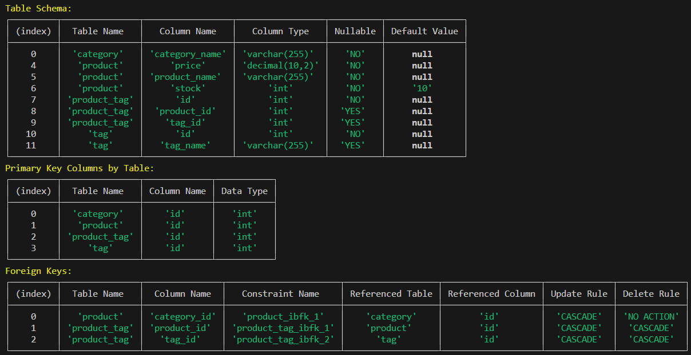
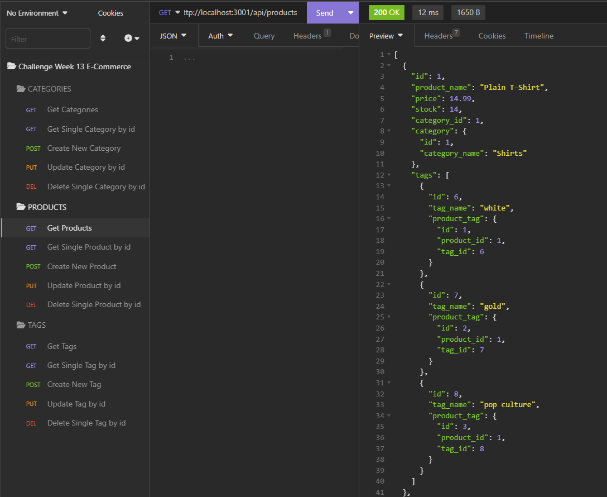

# Etrade-Engine

 [](https://opensource.org/licenses/MIT)

An e-commerce back-end using node.js, express.js and sequelize with a MySQL database.

## Description

This is server application that runs an ecommerce products back-end. It allows the user to view, add, update and delete products, categories and tags. Categories and tags can be associated with multiple products, and products can have multiple tags. The application uses the express.js framework in a node.js environment, and a MySQL database using Sequelize.

## Table of Contents

- [Technologies Used](#technologies-used)
- [Installation](#installation)
- [Usage](#usage)
- [Demo](#demo)
- [Credits](#credits)
- [License](#license)
- [Contributing](#contributing)
- [Questions](#questions)

## Technologies Used

- JavaScript
- Node.js
- MySQL
- express.js npm package for creating the server
- mysql2 npm package for connecting to MySQL database
- sequelize npm package for modeling and mapping MySQL database to JavaScript
- dotenv npm package for storing environment variables
- chalk npm package for styling command line text
  
## Installation
  
Fork or copy the repository to your own machine. To install the necessary dependencies, run the following command in the terminal:
  
```bash
npm i
```

You must have MySQL installed on your machine or have access to a remote MySQL install.  Create a .env file in the root directory of the application.  Add the following lines to the .env file, replacing the values with your own, and other values as required for your MySQL installation:

```bash
DB_USER='your MySQL username'
DB_PASSWORD='your MySQL password'
DB_NAME='ecommerce_db'
```

## Usage

### Creating the database

To create the database, Option 1 is to open the terminal and navigate to the 'db' directory where you copied the repository.  Run the following command to open the MySQL shell:

```bash
mysql -u root -p
```

Enter your MySQL password when prompted.  Then run the following command to create the database:

```bash
source schema.sql
```

Option 2 is to run the following command in the terminal from the root directory of the application, which will use DDL to create the empty database:

```bash
npm run create-db
```

### Seeding the database

To create the tables and relationships and to seed the database, run the following command in the terminal from the root directory of the application:

```bash
npm run seed
```

### View the database schema

To view the database schema, run the following command in the terminal from the root directory of the application:

```bash
npm run show-schema
```



### Starting the server

To start the server, run the following command in the terminal from the root directory of the application:

```bash
npm run start
```

### Using the API

The following API routes can be accessed:

- /api/categories
- /api/products
- /api/tags

Each route has the following methods available:

- GET - get all records
- GET - get a single record by id
- POST - create a new record
- PUT - update a record by id
- DELETE - delete a record by id

To test the API, you can use an application such as Insomnia or Postman.



## Demo

A demo of the application can be viewed [here](https://drive.google.com/file/d/1TVkwGzjFiJhtfSdDftV9F6kEu5O0SclG/view?usp=sharing).

It is also saved in this repository as [etrade-engine-walkthrough.mp4](./docs/etrade-engine-walkthrough.mp4).

## Credits

JavaScript runtime: [Node.js](https://nodejs.org/en/)

MySQL database: [MySQL](https://www.mysql.com/)

MySQL npm package: [mysql2](https://www.npmjs.com/package/mysql2)

Sequelize ORM: [sequelize](https://sequelize.org/)

Express.js framework: [express.js](https://expressjs.com/)

Environment variables: [dotenv](https://www.npmjs.com/package/dotenv)

Command line text styling: [chalk](https://www.npmjs.com/package/chalk)

## License
  
This repository is licensed under the [MIT](https://opensource.org/licenses/MIT) license.
  
## Contributing
  
Contributions to this project will not be accepted, as this project is an assessment piece for a coding course, and it must be the project author's own work. However, feel free to fork the repository and make your own changes.
  
## Questions
  
If you have any questions about the repository, open an issue or contact me directly at:
[rene.malingre@gmail.com](mailto:rene.malingre@gmail.com).
  
You can find more of my work at [GitHub](https://github.com/ReneMalingre).
